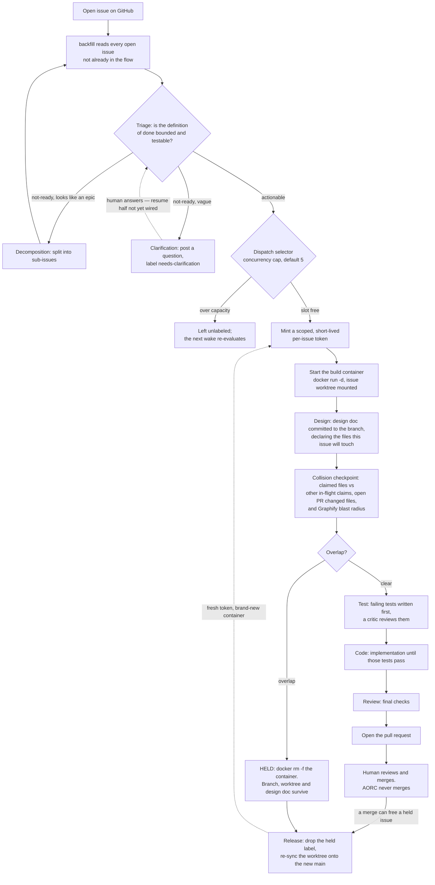
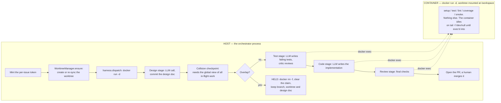

# AORC — Autonomous Orchestrated Repo Contributor

AORC takes a GitHub issue written in plain English and drives it to a reviewed pull request without a human writing code. It plans the change, writes failing tests, writes the implementation, reviews its own work, and opens a PR. A human approves the merge.

It is a custom orchestrator built around Claude — not a wrapper over an agent framework. That choice, and the safety machinery it enabled, is most of what makes this project interesting.

> **Status: working prototype.** The pipeline runs end to end against a live repo and has been verified on real multi-issue runs. Several safety components are implemented and tested but not yet wired into the live path — these are listed explicitly under [Known gaps](#known-gaps). Treat it as a serious prototype, not a production system.

---

## How it works

A single issue moves through seven stages:

```
Setup → Triage → Design → Test → Code → Review → Pull Request → (human merges)
```

- **Setup** — mint a scoped token, create a git branch and worktree, start a container
- **Triage** — is this issue actionable? Too vague, or too large and in need of decomposition?
- **Design** — Claude writes a design document: interface, test specs, task list, files to touch. Committed to the branch.
- **Collision checkpoint** — the declared file list is compared against every other in-flight issue and open PR. Overlap means this issue is held until the conflict clears.
- **Test** — Claude writes tests *before* the implementation exists. They must fail for the right reason. A second Claude acts as critic on the tests.
- **Code** — Claude writes the implementation until the pre-written tests pass. Existing code in touched files must survive.
- **Review** — final checks (coverage, gates), then open the PR.
- **Merge** — a human decides. AORC never merges.

State lives in GitHub issue labels (`in-design`, `in-test`, `in-code`, `in-review`, `aorc-held`, `agent-blocked`). There is no private database — where an issue stands is visible to anyone looking at the repo.

**Nine distinct Claude agent roles** exist across the pipeline; a clean run uses six LLM calls (triage, design, tester, test-critic, coder, reviewer). Only the Test stage has a critic pair.

### The full flow

`backfill` is the orchestration entry point. It reads *every* open issue that isn't already in the flow, triages each one, and dispatches actionable ones up to the concurrency cap:



A rebase conflict during that re-sync is never auto-resolved — the issue is labeled `agent-blocked` with the conflict output attached.

Note what the container is *not* doing above: the stages themselves run in the orchestrator process. See the next section.

---

## Design decisions, and why

### Custom orchestrator rather than an agent framework

The value of this system is its safety rules — test locking, red-vs-error separation, collision detection, credential scrubbing, single-minter token issuance. Those are far easier to verify and enforce when you own every line of the control flow. A framework optimises for agent coordination; the hard problem here was never coordination, it was *constraint*.

### Tests are written before the implementation, always

This is the keystone. A pre-written failing test is an objective definition of "done" that neither the model nor the operator can talk their way around. It is also what makes the system reviewable by someone who isn't reading every diff: you watch tests go from red to green rather than auditing generated code line by line.

A distinction the pipeline enforces carefully: a test that **fails** because the feature doesn't exist yet (`red`) is correct and expected. A test that **errors** because it can't even be collected is not — that's a broken test, and the stage refuses to advance on it.

### Labels on GitHub are the single source of truth

Pipeline state is stored where humans already look. The cost is that messy labels mean messy state; the benefit is that there is exactly one version of the truth and no hidden bookkeeping that can silently disagree with reality.

### Every build runs in a disposable container

Freshly generated code is untrusted code. It executes inside a sealed container built from a template image, never on the host. One container per **build attempt** — not per issue lifetime. When an issue is held, its container is destroyed; on release, a fresh one is created and the worktree is re-synced onto the current `main`.

**The git branch is the state carrier across hold and release, never the container.** This is the single most load-bearing idea in the runtime model.

The boundary is narrower than "the agents live in a box", and the distinction matters:



Every LLM call, file write and git commit happens on the host. What crosses into the container is the *execution of generated code* — the `setup`, `test`, `lint`, coverage and smoke commands from the target repo's config, run via `docker exec` against the mounted worktree. That is the untrusted part, and it is the only part that needs sealing.

Running the stages themselves inside the agent's own container — the full in-agent execution path — remains out of scope for v1.

### Concurrency is gated on declared file overlap

After design (and only after design, because that's when the touched files are known), the orchestrator compares the issue's claimed files against all in-flight work and open PRs. Non-overlapping issues run in parallel; overlapping ones are held with a breadcrumb comment explaining why. When the blocking work merges, the held issue is released, rebased onto the new `main`, and re-run — so it accumulates on top of finished work rather than clobbering it.

Verified live: two issues touching the same file were correctly sequenced while an independent issue ran in parallel; the released issue's output contained the merged changes plus its own.

### Rebase conflicts are never auto-resolved

If re-syncing a released issue onto `main` conflicts, AORC aborts and labels `agent-blocked` with the conflict output. It does not guess at a resolution. Escalating honestly is treated as the correct outcome, not a failure.

### The human approves every merge

Merging changes the real default branch and is expensive to undo. That decision stays with a person. This gate has already caught a genuine regression before it reached `main`.

### Mechanical guards over model judgement

Where a constraint can be enforced deterministically, it is: credential scrubbing uses fixed patterns rather than asking a model what looks like a secret; the code stage runs a mechanical check that top-level names present before a write still exist after it; red-vs-error classification is structural, not inferred.

---

## Known gaps

Listed honestly, because the difference between "implemented" and "wired into the live path" has been the single most common source of bugs in this project.

| Component | Status |
|---|---|
| **Cost circuit-breakers** (per-issue / per-run / daily caps) | Implemented and tested, **zero live callers**. No spend metering currently runs. |
| **Wall-clock compute limit** | Implemented, never invoked. Runaway containers are bounded only by token expiry. |
| **Clarification reply→resume loop** | The question-asking half is wired; the reply-handling and resume half has no live callers. |
| **Escalation ladder** (retry on a stronger model) | Built, not routed through by any stage. |
| **Container teardown on success/block** | Only the *held* path tears down. Containers from successful or blocked runs linger until token expiry. |
| **Concurrency ceiling** | Enforced only in the batch dispatch path. Direct single-issue runs bypass it. |
| **Import path derivation** | The test import header is machine-written from the design's declared file path. When the design declares an unresolvable path (a typo, or a bare filename for a new module), the derivation faithfully produces an unimportable module. No validation currently checks that the derived module is reachable from the repo's declared source roots. |
| **Generated test file accumulation** | Per-issue test files are committed to the target repo and accumulate over runs. |

The recurring theme across all of these: **the components work; the wiring is where the bugs live.** Several were found only by running the system live after the unit tests were green.

This table is a summary. [AORC-HANDOVER.md](AORC-HANDOVER.md) Part 5 is the authoritative status, checked against the source.

---

## Running it

Requires Docker, Python 3.12, and a GitHub token scoped to the target repository.

### Install

Python comes from [uv](https://github.com/astral-sh/uv):

```bash
export PATH="$HOME/.local/bin:$PATH"   # uv
uv venv --python 3.12
uv pip install -e ".[dev]"             # tests only — zero third-party deps beyond pytest
```

A live run additionally needs the SDK extras behind the adapters: `claude` (or `openai`) for the model, `github` for the GitHub API, `apptoken` for the App-token exchange, and `actions` if `container.runtime: actions`:

```bash
uv pip install -e ".[dev,claude,github,apptoken]"
```

### Configure the target repo

Every target repository carries a `.aorc.yml` describing its toolchain. It must exist and parse, and it must define `setup` and `test` — AORC fails closed rather than guessing a build command. `$VAR` references are expanded from the environment, so no secret is ever written into the file:

```yaml
llm:
  primary:
    provider: claude
    model: claude-sonnet-4-6
    api_key: $ANTHROPIC_API_KEY
  escalation:                    # optional; used by the escalation ladder
    provider: claude
    model: claude-sonnet-4-6
    api_key: $ANTHROPIC_API_KEY

setup: pip install -e .          # required
test: pytest                     # required
lint: ruff check .               # optional

failure:
  primary_attempts: 3
  escalation_attempts: 1
merge:
  auto: false                    # AORC never merges unattended without this AND a smoke: block
```

Also available: `coverage.command` / `coverage.floor` (default 80), `dispatch.concurrency` (default 5), `cost.*` caps, `compute.wall_clock_minutes` (default 45), and `container.runtime: docker | actions`. See `src/aorc/config.py` for the full schema.

### Run

```bash
# Run a single issue end to end
python -m aorc --config <config>.yml --repo <owner>/<repo> run-issue <n>

# Process all open issues, applying collision and concurrency rules
python -m aorc --config <config>.yml --repo <owner>/<repo> backfill

# Sweep held issues and release any the latest merges unblocked
python -m aorc --config <config>.yml --repo <owner>/<repo> wake
```

`run-issue` is the predictable path for one issue. `backfill` is the orchestration path — it discovers open issues itself, applies the concurrency ceiling, and holds colliding work.

A live run needs a registered GitHub App (`AORC_GITHUB_APP_ID` + `AORC_GITHUB_APP_PRIVATE_KEY_PATH`), which is what mints the per-issue, single-repo, short-lived container tokens. Passing **`--dev-pat-minter`** skips the App and hands the same fixed `GITHUB_TOKEN` PAT to every container instead. That is a development escape hatch — it removes the per-issue scoping the credential model is built on, and should never be used for a live run.

### Local dashboard (optional)

A read-only status dashboard with trigger controls lives on a separate branch. It is an additive layer: it imports the core's GitHub adapter and shells out to the same CLI commands, and makes no changes to the core.

```bash
uvicorn ui.bridge.app:app --port 8000
```

---

## Test suite

```bash
.venv/bin/pytest -q      # or: uv run pytest -q
```

580 tests, plus 13 integration tests deselected by default (real adapters, gated on credentials or a Docker daemon; each skips cleanly when its credential is absent). The default suite runs entirely against fakes — no network, no Docker — which is fast and hermetic, and is also precisely why several bugs surfaced only under live runs. The gap between the fake adapter and the real one has been the most productive place to look for defects.

---

## Repository layout

```
src/aorc/
  __main__.py         CLI entry point and composition root — the only module
                      allowed to construct real SDK-backed adapters
  interfaces.py       GitHubClient / LLMClient / Issue / PullRequest — the seam
                      everything else depends on
  config.py           .aorc.yml parsing; fails closed

  wake.py             orchestrator: backfill, dispatch, held sweep, token expiry
  dispatch.py         dispatch selector: concurrency ceiling and eligibility
  driver.py           pipeline driver: walks one issue through the four stages
  pipeline.py         label state machine and artifact checks
  harness.py          containers, worktrees, collision checkpoint, teardown

  triage.py           actionable vs not-ready, plus the epic/vague hint
  clarification.py    grill-me question stage for vague issues
  decomposition.py    splits an epic into sub-issues
  design.py           design stage and file-path resolution
  tester.py           test stage, critic, import header machinery, test runners
  coder.py            code stage and preservation guard
  reviewer.py         review stage and gates
  merge.py            merge-time handling and held release
  escalation.py       retry ladder onto the escalation model

  credentials.py      per-issue token minting and the permission ceiling
  guards.py           cost and compute circuit-breakers
  gitops.py           git plumbing
  install.py          board/label/config-PR installation and webhook routing
  webhook.py          HMAC-verified GitHub webhook receiver
  graphify.py         blast-radius queries used by the collision checkpoint
  graphify_adapter.py the adapter behind it

  github/             GitHub adapters: SDK-backed, App-token, Actions runtime
tests/                580 tests + tests/integration/ (6 credential-gated files)
```

---

## Further reading

- **[AORC-HANDOVER.md](AORC-HANDOVER.md)** — start here for a full account: setup from scratch, the architecture decisions, and an authoritative status of what is wired vs. not.
- **[HOW-IT-WORKS.md](HOW-IT-WORKS.md)** — a short guided tour of the code with file references.
- **[AORC-DEEP-DIVE.md](AORC-DEEP-DIVE.md)** — module-by-module reference with a full dry-run trace.
